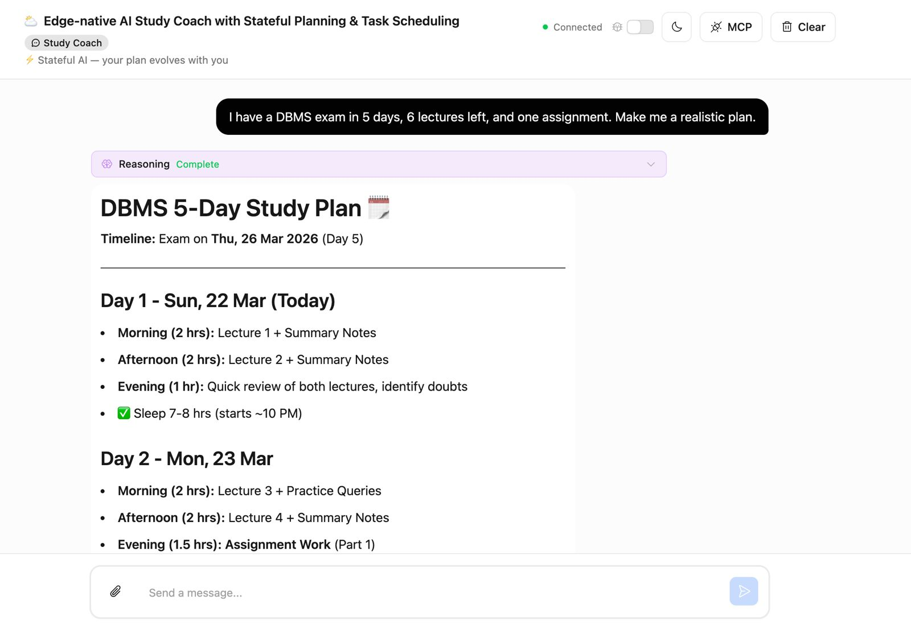
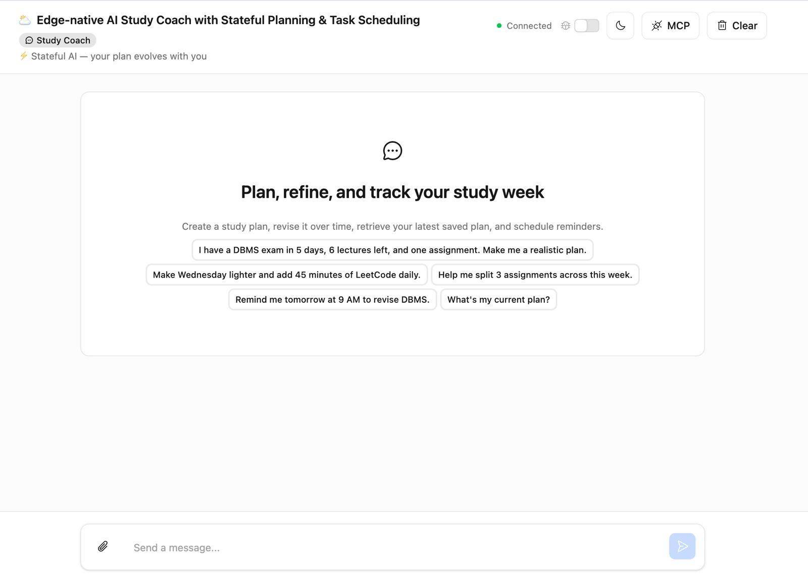
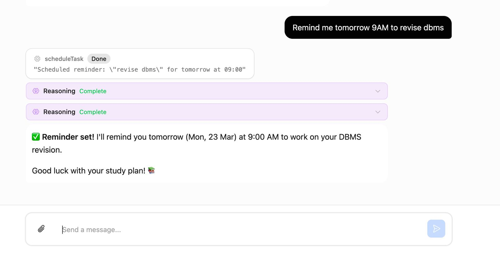

# AI Study Coach (Cloudflare Agents)

An edge-native AI application built on Cloudflare Agents that generates personalized study plans, supports iterative refinement through persistent memory, and schedules tasks using durable, stateful workflows.

Designed to simulate how real-world AI assistants manage evolving user context and long-running workflows.

---

### 🧠 AI generates a personalized study plan


---

### ⚡ Quick-start prompts for easy interaction


---

### ⏰ Built-in task scheduling & reminders


---

## Why this project

Most AI applications today are **stateless** — they lose context across interactions.

This project demonstrates how to build a **stateful AI system at the edge**, where:
- user context persists across sessions
- plans can be incrementally refined
- tasks can be scheduled and executed asynchronously

---

## Features

- Conversational study planning using Workers AI (LLM)
- Persistent memory using Durable Objects
- Iterative plan refinement (context-aware updates)
- Task scheduling and execution (workflow support)
- Real-time streaming chat UI
- **Stateful Plan Memory (WOW factor)**:
  - Stores the latest study plan in agent state
  - Allows retrieval via natural language ("What’s my current plan?")
  - Enables structured plan evolution across multiple turns

---

## Stateful Plan Memory (Key Highlight)

Unlike traditional chat-based apps, this system persists the **latest generated plan** explicitly in agent state.

This enables:
- retrieving the current plan at any time
- updating plans incrementally
- maintaining continuity across interactions

Example:
User: Make me a plan
→ Plan generated

User: Make Wednesday lighter
→ Plan updated

User: What’s my current plan?
→ Retrieved from persistent state


---

## Architecture
User → Pages UI → Agent (Durable Object) → Workers AI
↳ Persistent State (latestPlan)
↳ Scheduling (tasks/workflows)


---

## Example Flow

1. User: “I have an exam in 5 days…”
2. Agent generates structured study plan
3. User: “Make Wednesday lighter”
4. Agent revises plan using memory
5. User: “What’s my current plan?”
6. Agent retrieves plan from persistent state
7. User: “Remind me tomorrow at 9 AM”
8. Agent schedules task using workflow

---

## Tech Stack

- **Cloudflare Agents** (stateful AI agents)
- **Durable Objects** (persistent memory)
- **Workers AI** (LLM inference at the edge)
- **Vite + React** (frontend)
- **Zod** (tool validation)
- **AI SDK** (streaming + tool execution)

---

## Key Engineering Concepts

- Stateful agent design using Durable Objects
- Tool-based LLM interaction (getCurrentPlan, scheduleTask)
- Context pruning for efficient inference
- Separation of conversational memory vs persistent state
- Event-driven workflow execution (scheduled tasks)

---

## Why Cloudflare

This project leverages Cloudflare’s edge-native architecture:

- Durable Objects → stateful agents
- Workers AI → low-latency inference
- Built-in scheduling → long-running workflows

It demonstrates how AI systems can evolve from:
> stateless APIs → persistent, interactive agents at the edge

---

## How to run locally

```bash
npm install
npm run dev

Then open:
http://localhost:5173

```

## Live Demo

Here is a link where you can access the agent live:

https://cf-ai-study-planner.shireenmeher296.workers.dev

## Future Improvements
- Plan versioning (compare old vs new)
- Recurring schedules (daily study reminders)
- Browser notifications for reminders
- Multi-user plan isolation

## Summary

This project demonstrates how to build production-style AI systems, not just chatbots — combining:

- memory
- workflows
- tool usage
- and edge-native execution

into a cohesive, stateful experience.